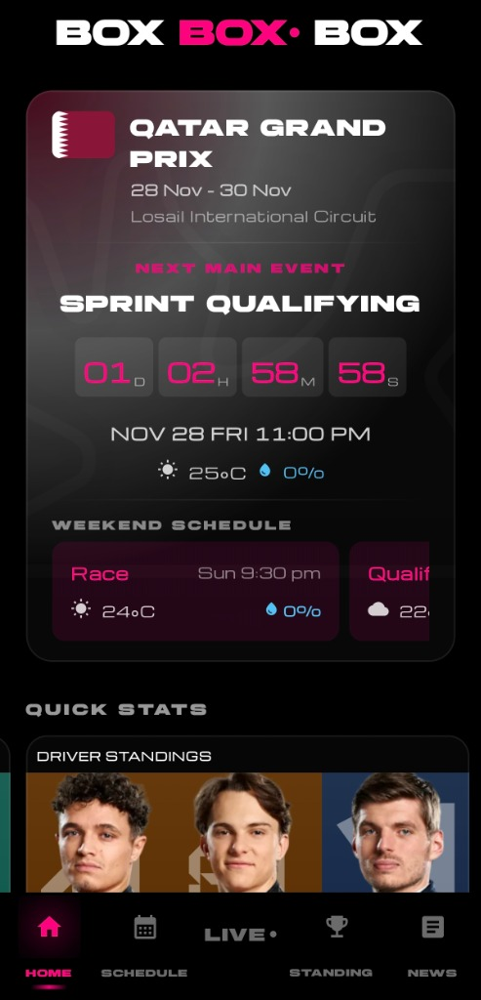
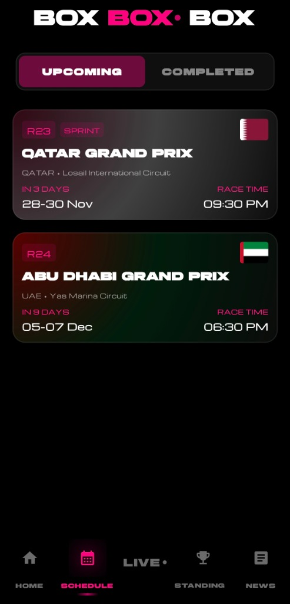
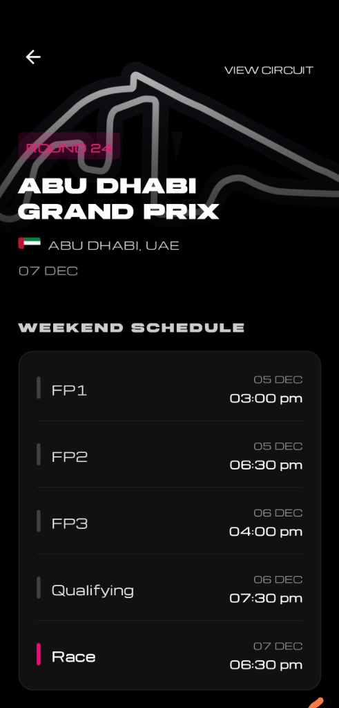
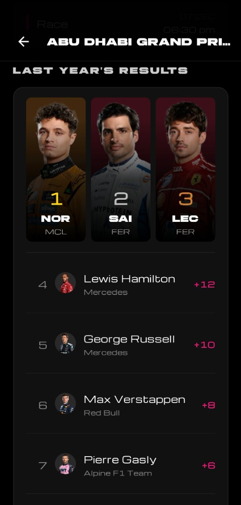
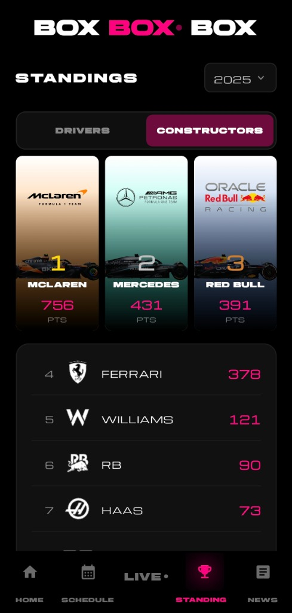
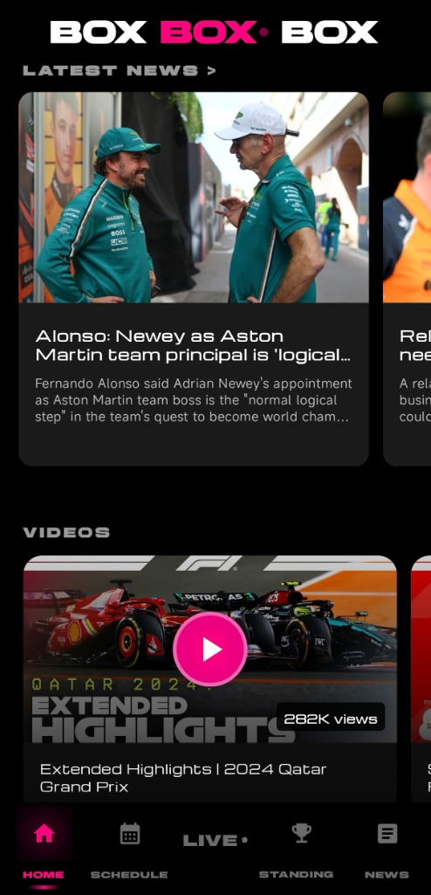
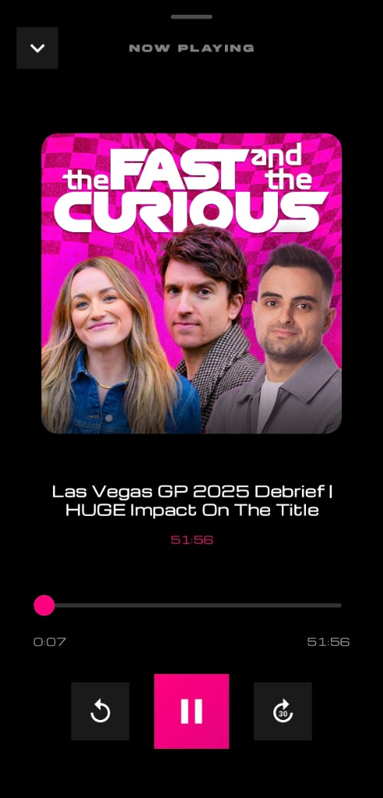

# BOX. BOX. - The Ultimate F1 Companion

**BOX. BOX.** is a modern, high-performance Android application designed to provide Formula 1 enthusiasts with a comprehensive and immersive race weekend experience. Built with cutting-edge Android technologies, it delivers real-time data, news, and multimedia content in a sleek, dark-themed interface.

## 📱 Application Overview

This application serves as a central hub for all things Formula 1, offering users instant access to schedules, standings, live session data, and team updates. It is engineered with a focus on performance, aesthetics, and user experience, leveraging the power of Jetpack Compose and Material 3 Design.

### Key Features

*   **Live Race Control**: Real-time session tracking with intelligent countdowns and live status updates.
*   **Comprehensive Schedule**: Detailed weekend schedules for all Grand Prix events, including Practice, Qualifying, and Sprint sessions.
*   **Circuit Intelligence**: In-depth circuit data including layout maps, lap records, and track specifications.
*   **Championship Standings**: Interactive Driver and Constructor standings with detailed points breakdowns and visual podiums.
*   **News & Multimedia Hub**: Aggregated news feeds and curated video highlights to keep users informed.
*   **Integrated Audio Player**: Built-in podcast player for listening to F1 content directly within the app.
*   **Push Notifications**: Real-time alerts for session starts and important updates via Firebase Cloud Messaging.
*   **Offline Capable**: Smart caching ensures essential data is available even without an active connection.

## 📸 Visual Tour

| **Live Session** | **Race Schedule** | **Circuit Details** | **Race Results** |
|:---:|:---:|:---:|:---:|
|  |  |  |  |

| **Driver Standings** | **Constructor Standings** | **News Hub** | **Audio Player** |
|:---:|:---:|:---:|:---:|
|  |  |  |  |

## 🛠 Technical Architecture

The project follows modern Android development best practices, utilizing a **Model-View-ViewModel (MVVM)** architecture pattern with **Clean Architecture** principles to ensure scalability, testability, and maintainability.

### Tech Stack

*   **Language**: Kotlin (100%)
*   **UI Framework**: Jetpack Compose (Material 3)
*   **Dependency Injection**: Dagger Hilt
*   **Asynchronous Processing**: Kotlin Coroutines & Flow
*   **Network**: Retrofit 2 & OkHttp 4
*   **Image Loading**: Coil
*   **Media Playback**: ExoPlayer (Media3)
*   **Notifications**: Firebase Cloud Messaging (FCM)
*   **Build System**: Gradle (Kotlin DSL)

### Data Sources & APIs

This application aggregates data from multiple public sources to provide a unified experience:

*   **Ergast Developer API**: Provides historical race data, schedules, and standings.
*   **OpenF1 API**: Supplies real-time session data and telemetry.
*   **RSS Feeds**: News content aggregated from major F1 publications.

## 📄 License

This project is licensed under the **MIT License** - see the [LICENSE](LICENSE) file for details.

## ⚖️ Disclaimer

**BOX. BOX.** is an unofficial application and is not associated in any way with the Formula 1 companies. F1, FORMULA ONE, FORMULA 1, FIA FORMULA ONE WORLD CHAMPIONSHIP, GRAND PRIX and related marks are trade marks of Formula One Licensing B.V.

All images and team logos used within the application are for identification purposes only and remain the property of their respective owners.
