<div align="center">

# 🏎️ BOX·BOX·BOX

### *The Ultimate F1 Companion App For Android*

[](https://www.gnu.org/licenses/gpl-3.0)
[](https://www.android.com/)
[](https://kotlinlang.org/)
[](https://developer.android.com/jetpack/compose)

*Because antigravity is free and I love F1* 🏁

---

### 🤖 Built 100% with 

<table>
  <tr>
    <td align="center"><br/><sub><b></b></sub></td>
    <td align="center"><br/><sub><b></b></sub></td>
    <td align="center"><br/><sub><b></b></sub></td>
  </tr>
</table>

---

[Download APK](boxboxbox.apk) • [Features](#-features) • [Screenshots](#-screenshots) • [Tech Stack](#-tech-stack)

</div>

---

## 📱 About

**BOX·BOX·BOX** is a meticulously crafted Android application that brings the entire Formula 1 experience into your pocket. Designed for die-hard fans who demand instant access to race schedules, live timing, championship standings, news, videos, podcasts, and social content—all in one sleek, dark-themed interface.

Built with **100% Kotlin** and powered by **Jetpack Compose**, this app delivers a premium, fluid user experience that feels native to modern Android while maintaining blazing-fast performance.

---

## ✨ Features

### 🏠 **Feed — Your F1 Command Center**

The heart of the app is the **Feed** tab, offering five specialized views:

#### **📰 Latest** — Bento Grid Discovery
- **Pinterest-style Bento layout** with dynamically sized cards
- Mixed content stream featuring news, videos, podcasts, and social posts
- **Quick Hotlap game access** embedded directly in the feed
- Intelligent content mixing for maximum variety
- Tap any Instagram post to jump to it in the Social tab

#### **📄 News** — Curated Headlines
- Multi-source aggregation from top F1 publications
- Smart categorization: **Headlines**, **Paddock Talk**, and **Extras**
- **"All News"** view for complete coverage
- Rich cards with headlines, sources, and publish times
- Swipe-to-refresh for latest updates

#### **🎥 Videos** — YouTube Integration
- Smart filters: **Hot** (trending), **Latest**, **Highlights**, **Popular**, **Official**
- Advanced scoring algorithm with age decay
- Strict highlight filtering (no shorts, reactions, or interviews)
- F1 official channel de-prioritization for diverse content
- In-app YouTube player with fullscreen support

#### **🎙️ Podcasts** — Audio Player
- Browse and play F1 podcasts directly in-app
- **Integrated audio player** with play/pause controls
- Episode cards with artwork and duration
- Background playback support

#### **📸 Social** — Instagram & Reddit
- **Instagram Feed**: Curated F1 content from teams, drivers, and fan accounts
- **Reels Mode**: Full-screen vertical video experience
- **Reddit Feed**: Hot posts from r/formula1
- Smart sorting with engagement-based scoring
- Improved diversity (less F1 official repetition)

---

### 🗓️ **Schedule — Never Miss a Session**

#### **📅 Upcoming Races**
- Complete 2025 F1 calendar
- Detailed weekend schedules (Practice, Qualifying, Sprint, Race)
- Session countdowns with local time conversion
- Circuit information and track layouts

#### **🏆 Results**
- Past race results with full podium data
- Session-by-session breakdowns
- Driver and team performance insights

---

### 🏆 **Standings — Championship Tracker**

#### **👤 Driver Standings**
- Live championship leaderboard
- Points breakdown and podium stats
- Driver headshots and team colors
- Historical season data

#### **🏁 Constructor Standings**
- Team championship rankings
- Points accumulation and visual team branding
- Animated team car displays

#### **🎄 Season Break Mode**
- Dedicated off-season screen with countdown to next race
- Animated champion showcases (driver & constructor)
- Toggle between driver headshots and team cars
- Smooth transitions and premium aesthetics

---

### 📡 **Live — Real-Time Race Control**

- **SignalR integration** for live F1 timing data
- Session-specific views:
  - **Race/Sprint**: Live positions, gaps, tire compounds, pit stops
  - **Qualifying**: Sector times, knockout zones, fastest laps
  - **Practice**: Best lap times and sector performance
- Team color-coded driver rows
- Countdown timers for upcoming sessions
- Automatic connection during live sessions

---

### 🎮 **Games — Mini-Games Hub**

#### **⏱️ Hotlap** — Reflex Test
- Full-screen racing game with F1 circuits
- **6 authentic tracks**: Monaco, Silverstone, Spa, Monza, Suzuka, Masters Circuit
- Dynamic difficulty scaling
- Lap time tracking and personal bests
- Immersive gameplay with realistic track layouts

#### *More games coming soon:* Strategy, Pit Stop Challenge

---

### 🔔 **Smart Notifications**

- **Firebase Cloud Messaging** integration
- Session start alerts
- Breaking news notifications
- Manual dispatch support for custom announcements
- Quiet hours and spam prevention

---

### 🎨 **Premium Design & UX**

- **Material 3 Design System** with custom F1 theming
- **Dark mode optimized** for OLED displays
- **Liquid glass navigation bar** with smooth animations
- **Michroma & Brigends fonts** for that motorsport feel
- Gradient accents and team color integration
- Buttery smooth 60fps animations
- Responsive gestures and haptic feedback

---

## 📸 Screenshots

<div align="center">

### Feed & Home

<table>
  <tr>
    <td>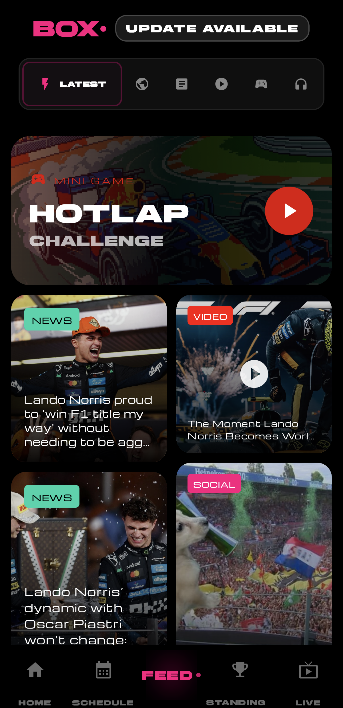<br/><sub><b>Latest Feed</b> - Bento Grid</sub></td>
    <td><br/><sub><b>Home</b> - Curated Content</sub></td>
    <td>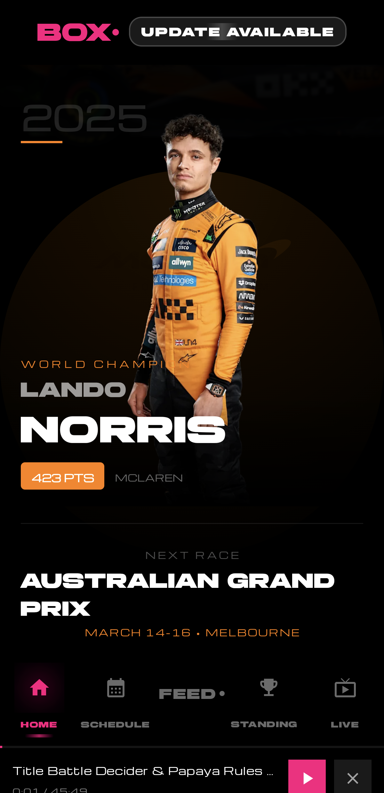<br/><sub><b>Home</b> - Alternate View</sub></td>
  </tr>
</table>

### Schedule & Live Timing

<table>
  <tr>
    <td>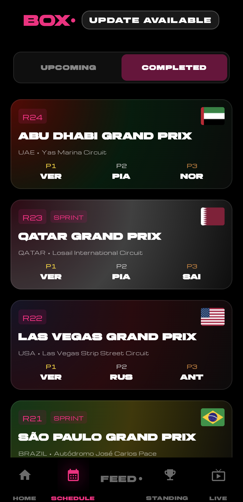<br/><sub><b>Schedule</b> - 2025 Calendar</sub></td>
    <td>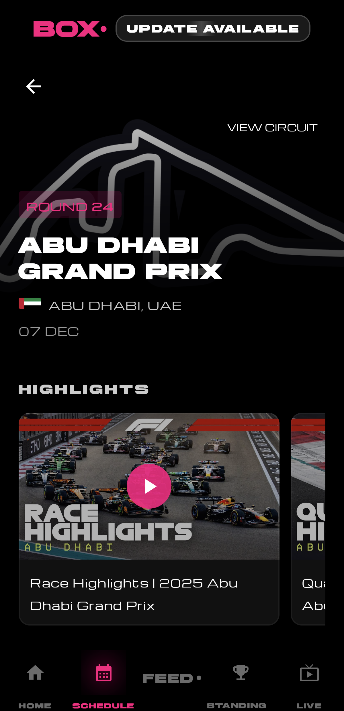<br/><sub><b>Race Weekend</b> - Details</sub></td>
    <td><br/><sub><b>Live</b> - Real-time Data</sub></td>
  </tr>
</table>

### Standings

<table>
  <tr>
    <td>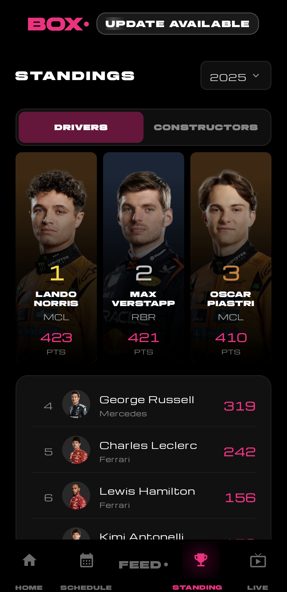<br/><sub><b>Drivers</b> Championship</sub></td>
    <td>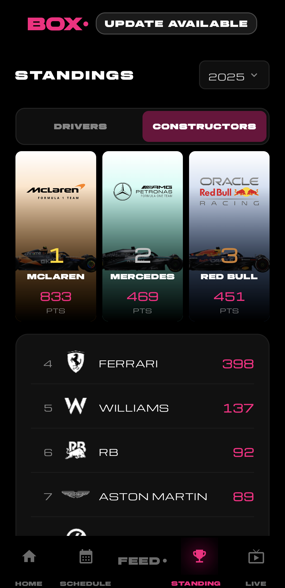<br/><sub><b>Constructors</b> Championship</sub></td>
  </tr>
</table>

### Social Feeds

<table>
  <tr>
    <td>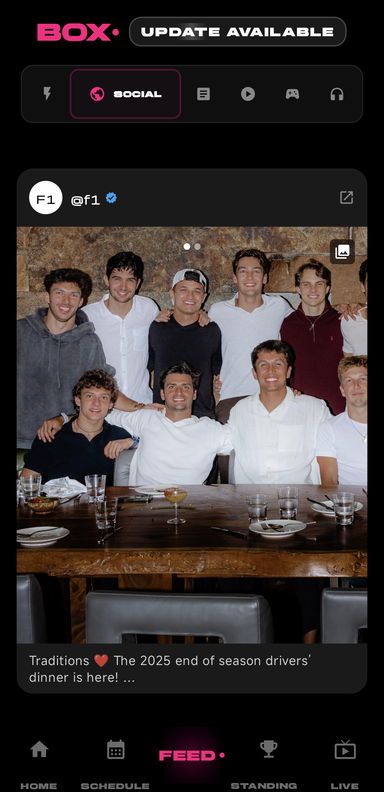<br/><sub><b>Social</b> - Instagram</sub></td>
    <td>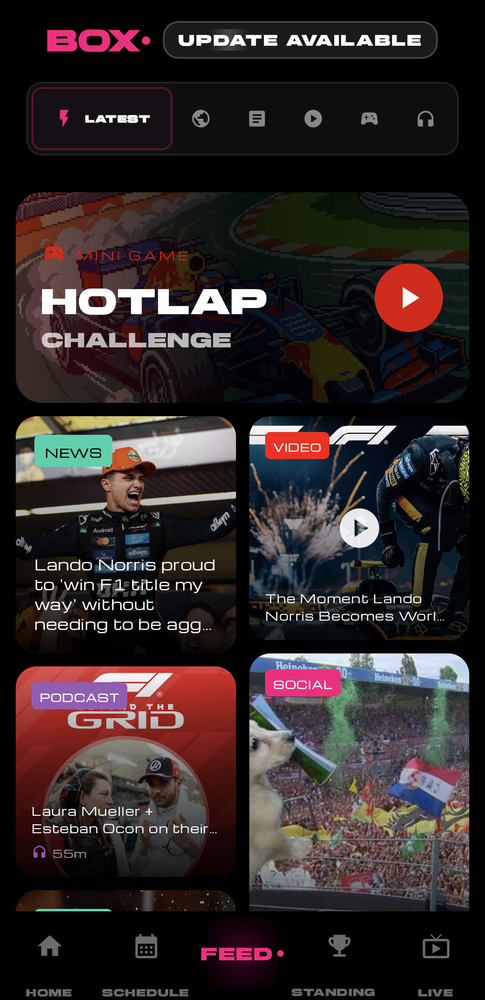<br/><sub><b>Social</b> - Reddit</sub></td>
  </tr>
</table>

### News, Videos & Podcasts

<table>
  <tr>
    <td>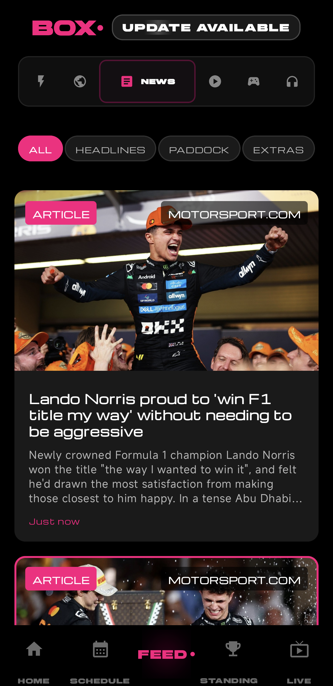<br/><sub><b>News</b> - Headlines</sub></td>
    <td>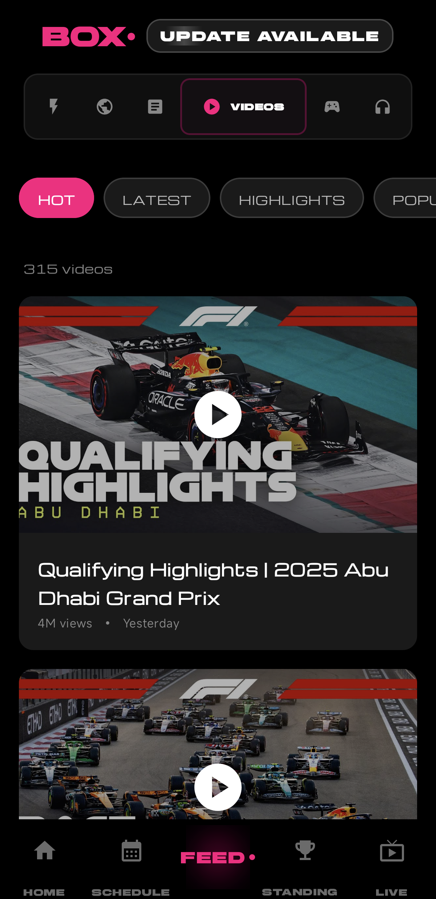<br/><sub><b>Videos</b> - YouTube</sub></td>
    <td>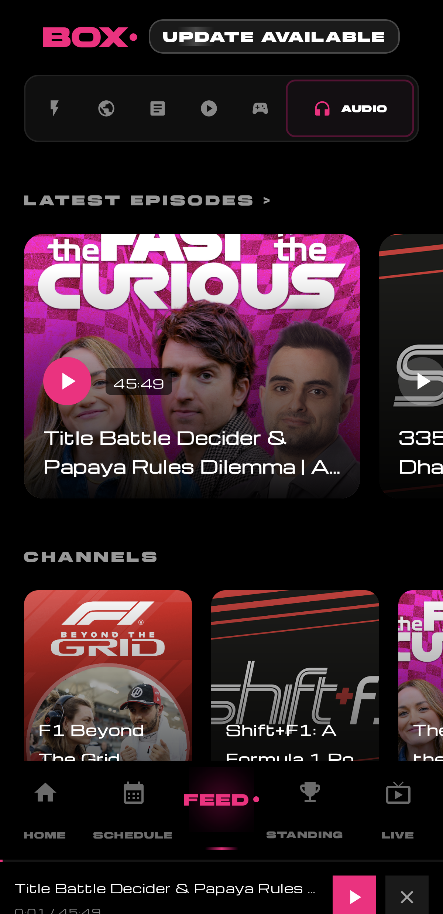<br/><sub><b>Podcasts</b> Feed</sub></td>
  </tr>
  <tr>
    <td>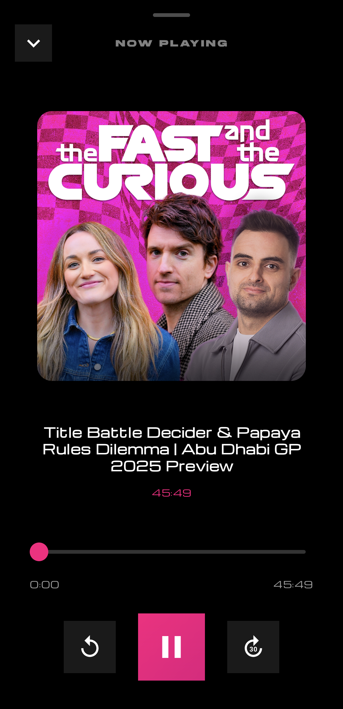<br/><sub><b>Audio Player</b> Controls</sub></td>
  </tr>
</table>

### Games

<table>
  <tr>
    <td>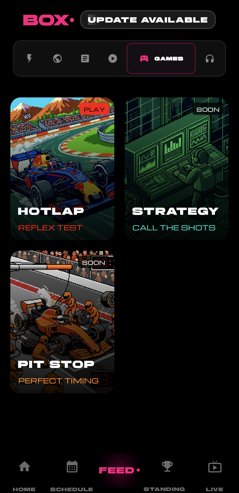<br/><sub><b>Games</b> - Hub</sub></td>
    <td>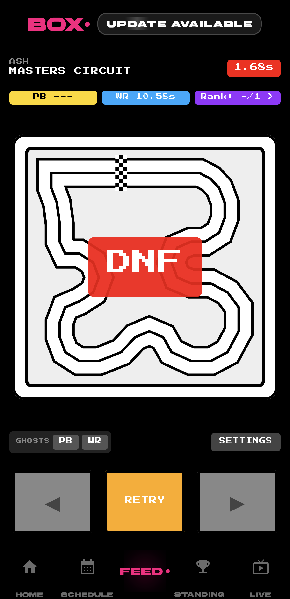<br/><sub><b>Hotlap</b> - Mini Game</sub></td>
  </tr>
</table>

</div>

---

## 🛠️ Tech Stack

### **Core Technologies**

| Technology | Purpose |
|-----------|---------|
| **Kotlin** | 100% Kotlin codebase for type-safe, concise code |
| **Jetpack Compose** | Modern declarative UI framework with Material 3 |
| **MVVM Architecture** | Clean separation of concerns with ViewModel pattern |
| **Coroutines & Flow** | Asynchronous programming and reactive streams |
| **Dagger Hilt** | Dependency injection for testable, modular code |

### **Networking & Data**

| Library | Usage |
|---------|-------|
| **Retrofit 2** | REST API client for F1 data sources |
| **OkHttp 4** | HTTP client with interceptors and logging |
| **SignalR** | Real-time WebSocket connection for live timing |
| **Coil** | Image loading with caching and transformations |

### **Media & Playback**

| Component | Description |
|-----------|-------------|
| **ExoPlayer (Media3)** | Video and audio playback for YouTube and podcasts |
| **YouTube Player** | Native YouTube integration with fullscreen support |
| **Custom Audio Player** | Podcast player with controls and background playback |

### **Push & Updates**

- **Firebase Cloud Messaging (FCM)** — Real-time notifications for news and session alerts
- **In-app Update Checker** — Automatic update detection and prompts

### **Build System**

- **Gradle (Kotlin DSL)** — Modern build configuration
- **GitHub Actions** — CI/CD for automated builds and releases

---

## 🌐 Data Sources

This app aggregates data from multiple public sources to provide a unified F1 experience:

| Source | Data Provided |
|--------|---------------|
| **Ergast Developer API** | Historical race data, schedules, results, standings |
| **OpenF1 API** | Real-time session data and telemetry |
| **F1 SignalR** | Live timing feed during race weekends |
| **RSS Feeds** | News aggregation from major F1 publications |
| **Instagram API** | Social content from teams, drivers, and fan accounts |
| **Reddit API** | r/formula1 community posts and discussions |
| **YouTube RSS** | Video content with custom filtering and scoring |

---

## 🚀 Getting Started

### **Download & Install**

1. Download the latest APK from [Releases](../../releases) or [direct link](boxboxbox.apk)
2. Enable "Install from Unknown Sources" in Android settings
3. Install and enjoy! 🏎️

### **Build from Source**

```bash
# Clone the repository
git clone https://github.com/yourusername/BOXBOXBOX-F1.git
cd BOXBOXBOX-F1

# Build the APK
./gradlew assembleRelease

# Install to connected device
./gradlew installRelease
```

**Requirements:**
- Android Studio Hedgehog or later
- Android SDK 34+
- Kotlin 1.9+
- Minimum Android 7.0 (API 24)

---

## 📋 Roadmap

### **v1.15.0** (Coming Soon)
- [ ] Strategy mini-game
- [ ] Pit stop challenge game
- [ ] Driver profile deep-dives
- [ ] Team profile pages
- [ ] Push notification customization

### **Future Plans**
- [ ] Tablet/foldable optimization
- [ ] Wear OS companion app
- [ ] Widget support for home screen
- [ ] Dark/Light theme toggle
- [ ] Fantasy F1 integration

---

## 🤝 Contributing

This is a personal passion project, but contributions are welcome! Here's how you can help:

1. **Report Bugs** — Open an issue with detailed reproduction steps
2. **Suggest Features** — Share your ideas in the Discussions tab
3. **Submit PRs** — Fork, code, and submit pull requests
4. **Spread the Word** — Share with fellow F1 fans!

---

## 📄 License

This project is licensed under the **GNU General Public License v3.0** — see the [LICENSE](LICENSE) file for details.

**Key Terms:**
- ✅ You may use, modify, and distribute this software
- ✅ Any derivative work **must also be open source** under GPL v3
- ✅ You must disclose the source code of any modifications
- ⚠️ No warranty is provided

---

## ⚖️ Legal Disclaimer

> [!IMPORTANT]
> **BOX·BOX·BOX** is an **unofficial, fan-made application** and is **not affiliated with, endorsed by, or connected to** Formula 1, Formula One Management, Formula One Licensing B.V., or any F1 teams, drivers, or sponsors.

> [!WARNING]
> **F1**, **FORMULA ONE**, **FORMULA 1**, **FIA FORMULA ONE WORLD CHAMPIONSHIP**, **GRAND PRIX**, and related marks are trademarks of **Formula One Licensing B.V.**

### Content Attribution

This application aggregates publicly available content from various sources including:
- Formula 1 official media and data feeds
- Instagram posts from F1 teams, drivers, and fan accounts
- YouTube videos from F1 channels and creators
- Reddit posts from r/formula1
- News articles from F1 publications
- Race data from public APIs (Ergast, OpenF1)

**All content remains the property of their respective copyright holders.** This app:
- Does **not claim ownership** of any third-party content
- Uses content solely for **informational and educational purposes**
- Generates **no commercial gain or revenue** whatsoever
- Is provided **completely free of charge** with no monetization
- Is a **non-profit, open-source** fan project

Users of this app are responsible for complying with the Terms of Service of content providers (Instagram, YouTube, Reddit, etc.) when accessing their content through this application.

---

<div align="center">

### Made with ❤️ and ☕ by an F1 fan

**If you love F1 and this app, give it a ⭐ on GitHub!**

[⬆ Back to Top](#%EF%B8%8F-boxboxbox)

</div>
