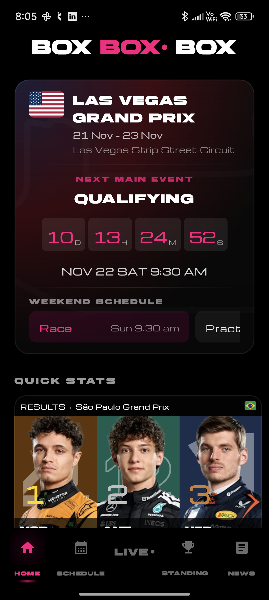

# BOXBOXBOX

Formula 1 tracking application for Android.

## Features

### 🏎️ Race Weekend
- **Live race weekend tracking** with session schedules
- **Session completion markers** - See which sessions are completed
- Real-time countdown timers for upcoming sessions
- Weather forecasts for each session
- Circuit track layouts with country flag gradients

### ⚡ Live Timing (v1.2)
- **Real-time F1 Live Timing** with SignalR WebSocket integration
- Live driver positions, lap times, gaps, and pit stops
- Connection status indicators
- Terminal-style RAW data view for debugging
- Automatic updates during live F1 sessions

### 📊 Standings & Results
- Driver standings with team colors
- Constructor standings
- Last race results with top 3 podium
- Completed qualifying and sprint results during race weekends

### 📰 Content
- F1 news from ESPN
- YouTube highlights videos with in-app player
- F1 podcasts with in-app audio player
  - The Fast and the Curious
  - The F1 Podcast
  - Autosport F1 Podcast

### 🎨 UI/UX
- Auto-scrolling stats cards
- Smooth animations and transitions
- Dark theme with sharp, modern design
- Custom fonts (Brigends Expanded, Michroma)

## Screenshots

<p align="center">
  
</p>

## Data Sources

- [Ergast F1 API](http://ergast.com/mrd/) - Race data, schedules, standings, results
- [ESPN F1 API](https://site.api.espn.com) - News articles
- [Planet F1 Live Timing](https://live.planetf1.com) - Real-time live timing via SignalR WebSocket
- [Open-Meteo Weather API](https://open-meteo.com) - Weather forecasts
- [flagcdn.com](https://flagcdn.com) - Country flags
- YouTube RSS Feeds - Video highlights
- Podcast RSS Feeds - F1 podcasts

## Tech Stack

- **Kotlin** - Programming language
- **Jetpack Compose** - Modern Android UI toolkit
- **Material Design 3** - Design system
- **Retrofit** - REST API client
- **OkHttp** - WebSocket client (SignalR)
- **SimpleXML** - XML/RSS parsing
- **ExoPlayer (AndroidX Media3)** - Audio/video playback
- **Coil** - Image loading
- **Coroutines & Flow** - Asynchronous programming
- **StateFlow** - State management

## Changelog

### v1.2 (Latest)
- ✨ Real-time F1 Live Timing with SignalR WebSocket
- ✨ Session completion markers with green gradient theme
- ✨ Weather data caching (no loss on screen off/on)
- 🎨 Redesigned Live Timing page with connection status
- 🎨 Short driver codes (VER, HAM, LEC, etc.)
- 🎨 Fixed card heights for consistent display
- 🎨 Improved countdown with 00 padding
- 🔧 Enhanced state management and error handling

### v1.1
- Initial release with core features

## Installation

### From Release
Download the latest APK from [Releases](https://github.com/ashwkun/BOXBOXBOX-F1/releases)

### Build from Source
   ```bash
git clone https://github.com/ashwkun/BOXBOXBOX-F1.git
   cd "BOXBOXBOX APP"
./gradlew assembleDebug
```

## Requirements

- Android 8.0 (API 26) or higher
- Internet connection

## Project Structure

```
app/
├── data/
│   ├── api/          # Retrofit services
│   ├── local/        # Local data providers
│   └── models/       # Data models
├── ui/
│   ├── components/   # Reusable UI components
│   ├── screens/      # App screens
│   └── viewmodels/   # ViewModels
└── res/
    ├── drawable/     # Team logos, circuit maps
    └── font/         # Custom fonts
```

## License

Educational purposes only.
